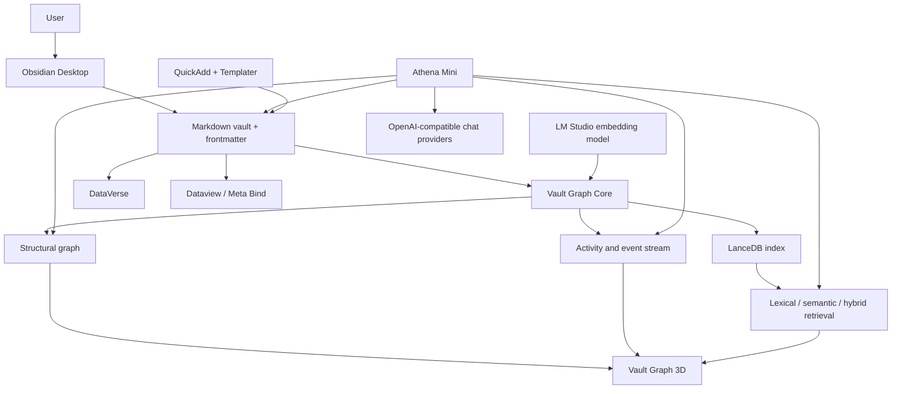

The project is a local-first “knowledge operating system” built inside Obsidian. Markdown files and frontmatter remain the source of truth; the custom plugins add retrieval, AI interaction, graph visualization, and data-driven interfaces around that foundation.





## 1. The architectural centre: Vault Graph Core

[Vault Graph Core](/C:/Users/chp/Desktop/Obsidian/spacetime/Development/VaultGraphCore/README.md) is the shared, headless service layer. It owns three main capabilities:

- Structural graph
- Persistent retrieval/indexing
- Human and agent activity events

It publishes a versioned API, currently `apiVersion: 2`, divided into:

- `graph`: nodes, links, neighbours, incoming/outgoing relationships, shortest paths and bounded subgraphs.
- `retrieval`: lexical, semantic and hybrid searches plus indexed note metadata.
- `index`: status, rebuild, reconciliation, verification and removal of derived data.
- `activities`: human and agent operations on notes.
- `events`: graph changes, index progress, retrieval completion and activity changes.

The API contract is visible in [main.ts (line 53)](/C:/Users/chp/Desktop/Obsidian/spacetime/Development/VaultGraphCore/src/main.ts:53).

### Structural graph

The graph is built from Obsidian’s metadata cache and vault events. It contains:

- Note nodes
- Tag nodes
- Unresolved-note nodes
- Wiki-link relationships
- Frontmatter-property relationships
- Note-to-tag relationships

Tags are represented as real nodes rather than turning every pair of similarly tagged notes into an edge. This prevents large tags from producing quadratic numbers of links.

The graph updates incrementally when notes are created, edited, renamed or deleted. Full rebuilding is reserved for startup, settings changes and manual recovery.

### Retrieval and LanceDB

Vault Graph Core owns the local LanceDB database. It stores:

- `notes`: stable note IDs, paths, titles, aliases, tags, frontmatter, timestamps and content hashes.
- `chunks`: heading-aware text chunks, offsets, tags, normalized search text and optional embedding vectors.

Documents are split into heading-aware chunks of up to roughly 4,000 characters with overlap. The implementation is in [lexical-index.ts (line 27)](/C:/Users/chp/Desktop/Obsidian/spacetime/Development/VaultGraphCore/src/lexical-index.ts:27).

Retrieval supports:

- Lexical search using LanceDB full-text search/BM25.
- Semantic search using cosine similarity.
- Hybrid search using reciprocal-rank fusion.
- Automatic degradation to lexical search when embeddings are unavailable.

The embedding service is OpenAI-compatible. In this vault it is configured to use LM Studio with `text-embedding-bge-small-en-v1.5`.

### Safe index lifecycle

The index is treated as disposable derived data—not as the authoritative vault.

Implemented safeguards include:

- Stable note and chunk identities.
- Content hashing to skip unchanged material.
- Incremental handling of create, modify, rename and delete events.
- Startup reconciliation to repair missed events.
- Separate per-device local data.
- Parallel generation builds.
- Validation before switching generations.
- Atomic activation of a new generation.
- Retention of the active and previous valid generations.
- Search availability while a replacement generation is being built.
- Mandatory exclusions for `.obsidian`, `.git`, `.trash` and `node_modules`.

### Native runtime management

LanceDB requires a native binary. Core does not import it during ordinary plugin startup.

Instead, it can:

1. Detect the operating system and CPU.
2. Download only the pinned platform package.
3. Verify the npm SHA-512 integrity.
4. Extract only the required native file.
5. Record and recheck its SHA-256 fingerprint before loading.

If this runtime is absent or broken, the structural graph still works.

The separate [LanceDB Runtime PoC](/C:/Users/chp/Desktop/Obsidian/spacetime/Development/LanceDbObsidianPoc/README.md) was the proof used to validate this approach. It is not an enabled production plugin; its successful design was incorporated into Vault Graph Core.

## 2. Athena Mini: AI and controlled vault operations

[Athena Mini](/C:/Users/chp/Desktop/Obsidian/spacetime/Development/AthenaMiniObsidian/README.md) is the conversational agent layer.

It does not contain its own model. Instead, it talks to OpenAI-compatible `/chat/completions` endpoints. This supports local or hosted systems such as:

- LM Studio
- Ollama’s compatible API
- Other OpenAI-compatible model servers
- Custom hosted providers

Provider configuration is independent from Core’s embedding configuration. The same LM Studio installation can serve both, but one model performs chat/tool calling while another produces embeddings.

### Athena’s relationship with Core

Athena obtains the `vault-graph-core` plugin instance from Obsidian and uses it for:

- Hybrid vault search
- Graph neighbours
- Shortest paths
- Index status
- Retrieval events
- Agent activity publication

Its tool catalogue is defined in [tools.ts (line 5)](/C:/Users/chp/Desktop/Obsidian/spacetime/Development/AthenaMiniObsidian/src/tools.ts:5). It currently exposes tools for:

- Searching and reading notes
- Opening notes visibly
- Inspecting paths and folders
- Listing notes by date
- Traversing graph relationships
- Creating notes and folders
- Appending and exact-text editing
- Moving files and folders
- Deleting notes, files and folders

When Athena searches, reads, traverses or edits a note, it publishes an agent activity through Core. Vault Graph then renders that activity around the affected node.

### Write-safety solution

Athena’s current policy is “ask before writing.”

The safety model goes beyond prompting the LLM:

- Read-only mode removes write tools from the model’s tool vocabulary.
- Notes must be read before editing.
- An edit requires the exact `mtime` revision returned by `read_note`.
- Replacements require a unique, exact source-text match.
- Conflicting edits are rejected.
- New notes cannot overwrite existing files.
- Moves refuse destination collisions.
- `.obsidian`, `.git`, `.trash` and `node_modules` are protected.
- Deletions always require explicit approval.
- Deleted items go to Obsidian’s recoverable trash.
- Folder contents are rechecked after approval and before mutation.
- File moves use Obsidian’s link-aware file manager.

### Workflow skills

Athena also has a small skill system. Markdown skill files live under:

```
.obsidian/athena-mini/skills
```

Slash commands load these reusable workflows dynamically. Skills can use active-note and date placeholders while reusing Athena’s normal tool runner, approvals, conflict checking and activity visualization.

### Fallback behaviour

When Core retrieval is working, Athena stops its older full-vault in-memory index.

A temporary compatibility option can use the old lexical index when Core is unavailable. That means Athena can degrade gracefully, although hybrid search and exact Core-backed filtering require the shared Core.

## 3. Vault Graph: visualization and observability

[Vault Graph](/C:/Users/chp/Desktop/Obsidian/spacetime/Development/VaultGraph/README.md) is the presentation layer for Core’s graph and event streams. It adds a separate 3D view and does not replace Obsidian’s built-in graph.

Its main frameworks are:

- Three.js
- `3d-force-graph`
- Obsidian’s ItemView/plugin APIs

The plugin asks Core for bounded subgraphs rather than loading an unlimited snapshot:

- Default initial limit: 1,000 nodes.
- Interactive upper bound: 5,000 nodes.
- Progressive context expansion around missing active or retrieved notes.

The bridge to Core is implemented in [core-store-bridge.ts (line 48)](/C:/Users/chp/Desktop/Obsidian/spacetime/Development/VaultGraph/src/core-store-bridge.ts:48).

Vault Graph subscribes to:

- Structural graph changes
- Human activity
- Athena agent activity
- Retrieval-completed events

If Athena retrieves notes outside the current visible graph, Vault Graph pulls those notes and a bounded one-hop neighbourhood into view.

Implemented visualization features include:

- 3D force-directed layout
- Wiki-link, tag and property relationships
- Directional arrows and moving particles
- Bloom
- User and agent activity rings
- Search/query-group colours
- Saved camera, selection, collapsed-node and pinned-position state
- Progressive graph expansion
- Filters by folder, path, tags and properties
- Focus, orbit, pan and zoom controls

When Core v2 is absent, Vault Graph has a compatibility adapter based on Obsidian metadata. That path exists for transition and recovery; Core is the intended backend.

## 4. DataVerse: native data-aware note interfaces

[DataVerse](/C:/Users/chp/Desktop/Obsidian/spacetime/Development/DataVerse/README.md) is a separate custom plugin. It is not directly coupled to Core, Athena, Dataview or Meta Bind.

It registers a `dataverse` Markdown code-block processor and uses Obsidian’s native vault, metadata and frontmatter APIs. See [main.ts (line 72)](/C:/Users/chp/Desktop/Obsidian/spacetime/Development/DataVerse/src/main.ts:72).

It implements visual builders and renderers for:

- Gallery grids
- Image carousels
- Bar, line and donut charts
- Stat cards
- Text and number inputs
- Checkboxes
- Sliders and progress displays
- Select and multi-select controls

DataVerse has three storage modes:

- Current-note frontmatter
- Persistent block-local storage
- Session-only storage

It reacts to metadata changes and redraws its views automatically. When an interactive element changes frontmatter, normal Obsidian events propagate that change to:

- Vault Graph Core’s structural graph
- Core’s LanceDB index
- Vault Graph
- Dataview or other metadata consumers

That is an indirect, event-driven integration through the vault.

## 5. Supporting community plugins

There are 17 enabled community plugins. Their relationships fall into functional groups.

### Knowledge and data layer

- **Dataview** provides query-driven views over notes and frontmatter.
- **Meta Bind** provides inline inputs, metadata displays and buttons.
- **DataVerse** provides dependency-free visual builders and native interactive blocks.
- **Tag Wrangler** manages the tag taxonomy.

Dataview and Meta Bind do not power DataVerse. All three independently read the same underlying vault metadata.

### Capture and temporal workflow

- **QuickAdd** creates notes from configured workflows.
- **Templater** expands reusable note templates.
- Obsidian’s core **Daily Notes** and **Templates** plugins provide the base scheduling/template functions.

The vault also contains day, week, month, quarter and year templates. New notes created by these tools are automatically discovered by Core, indexed by LanceDB and shown in Vault Graph.

### Presentation and navigation

- **Admonition** adds styled callout blocks.
- **Highlightr** adds colour-based highlighting.
- **MissionControl Banners** adds note and Base banners.
- **Explorer Colors & Lucide Icons** styles file navigation.
- **Style Settings** controls theme/plugin CSS variables.
- **Commander** exposes commands in convenient UI locations.
- **Better Export PDF** provides enhanced PDF export.

These plugins primarily affect presentation and workflow. They do not participate in the AI/retrieval API.

### Obsidian core capabilities

Important enabled core plugins include:

- File explorer and search
- Built-in graph, backlinks and outgoing links
- Canvas
- Properties
- Daily Notes and Templates
- Workspaces
- Bases
- Web Viewer
- File recovery

The custom system builds on these rather than replacing them.

There are also plugin directories for Excalidraw, Make.md, Featured Image, Notebook Navigator and Line Operations, but they are not in the enabled community-plugin list and therefore are not part of the active runtime architecture.

## 6. Framework and packaging stack

All four production custom plugins use the same basic development stack:

- TypeScript
- Obsidian Plugin API
- Node/Electron runtime supplied by Obsidian Desktop
- esbuild
- Plain CSS
- Compiled single-file `main.js` plugin bundles

There is no React application and no separate Python service or backend server.

Additional framework choices are intentionally narrow:

|Component|Main technology|
|---|---|
|Core graph|TypeScript maps and incremental adjacency indexes|
|Persistent search|LanceDB 0.33.0|
|Lexical retrieval|LanceDB FTS/BM25|
|Semantic retrieval|OpenAI-compatible embeddings + cosine search|
|Hybrid retrieval|Reciprocal-rank fusion|
|3D graph|Three.js + `3d-force-graph`|
|Athena models|OpenAI-compatible chat-completions API|
|DataVerse charts|Native responsive SVG|
|Persistence|Markdown/frontmatter plus local derived plugin data|

The installed `main.js` files for Core, Vault Graph, Athena and DataVerse are byte-for-byte identical to their corresponding development builds, so the source inspected here matches what is installed in the vault.

## 7. The complete operational flow

A typical Athena request follows this path:

1. The user asks Athena a question.
2. Athena sends the conversation and tool definitions to the selected chat model.
3. The model calls `search_vault`.
4. Athena calls Core’s retrieval API in `auto` mode.
5. Core embeds the query through LM Studio when semantic search is healthy.
6. LanceDB performs BM25 and vector retrieval.
7. Core merges the rankings and returns small excerpts.
8. Core publishes a retrieval event.
9. Vault Graph highlights or imports the retrieved notes and their neighbourhoods.
10. Athena reads authoritative full-note content through Obsidian before editing.
11. Any approved edit goes through Obsidian’s vault API.
12. Obsidian emits a file/metadata event.
13. Core updates the structural graph and LanceDB index.
14. DataVerse, Dataview and other views refresh from the same changed metadata.

The strongest architectural choice is the separation of responsibilities:

- Obsidian owns files and metadata.
- Core owns shared intelligence and derived state.
- Athena owns reasoning and controlled actions.
- Vault Graph owns visualization and observability.
- DataVerse owns interactive, data-driven note interfaces.
- Supporting plugins improve capture, presentation and navigation.

That separation keeps the vault portable, lets components degrade independently, and avoids making the user’s knowledge dependent on a proprietary database or external server.
