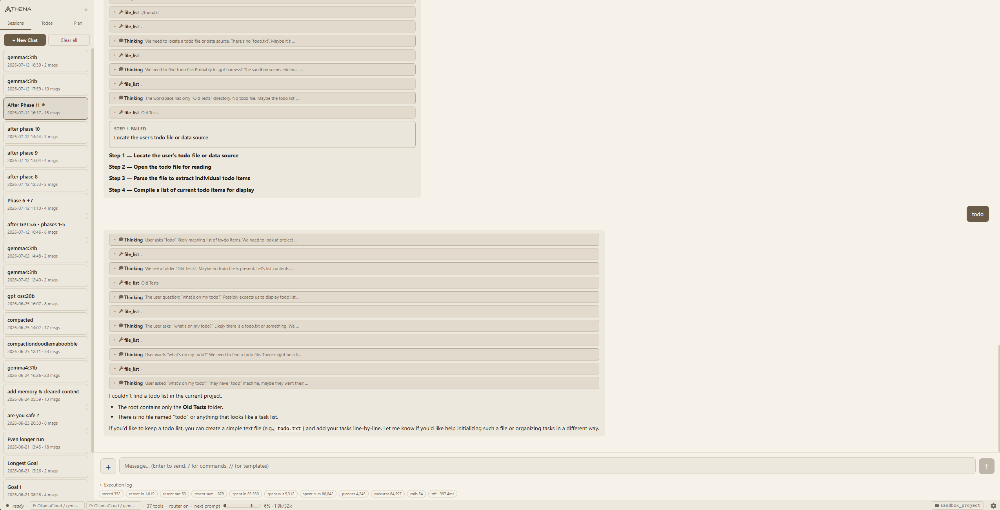
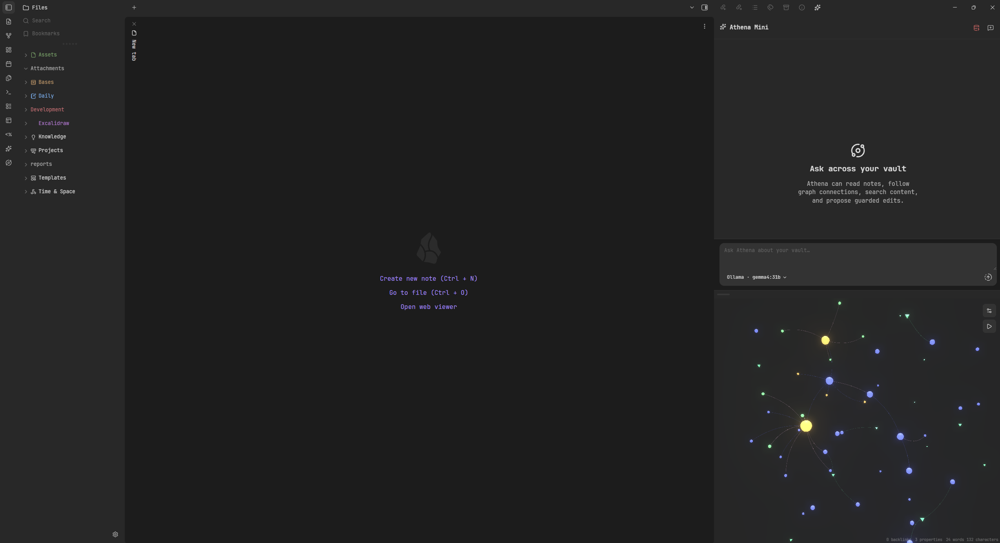

# Athena

### An open-source AI Harness & Ecosystem

**Athena** is an open-source, model-agnostic AI harness built to explore what happens when an AI system is allowed to extend beyond the boundaries of a chat window.

It provides a central environment for language models, tools, agents, memory, events, approvals and external interfaces — while remaining open to local models, different providers and custom integrations.

Around the core Harness sits a growing ecosystem of experiments and companion projects that extend Athena into other environments: personal knowledge, wearables, e-paper devices and long-term personal data.

> **Athena is the core. Everything around it extends what Athena can know, where it can exist, and how you can interact with it.**

---

## 🌌 Why Athena?

Most interaction with language models still looks something like this:

```text
Human → Chat Window → Model → Response
```

Athena started from a different question:

**What if the model was only one component of a larger system?**

A system that can:

* work with different local and remote models
* use real tools
* interact with external applications and devices
* maintain useful memory and context
* expose what it is currently doing
* request approval before performing sensitive actions
* work with personal knowledge
* interact through interfaces other than chat
* gradually build useful context about the person using it

Athena is an ongoing attempt to build that system.

---

# 🧠 The Athena Harness

The **Athena Harness** is the heart of the ecosystem.

It coordinates the interaction between the user, language models, tools, memory, agents and external systems.

Rather than building Athena around one particular model or provider, the Harness treats models as interchangeable reasoning components within a larger architecture.

```text
                         ┌─────────────────────┐
                         │       ATHENA        │
                         │                     │
                         │      AI Harness     │
                         │     & Ecosystem     │
                         └──────────┬──────────┘
                                    │
                         ┌──────────▼──────────┐
                         │   ATHENA HARNESS    │
                         │                     │
                         │   Models / LLMs     │
                         │   Tool Calling      │
                         │   Agents            │
                         │   Memory            │
                         │   Events            │
                         │   Approvals         │
                         │   API               │
                         └──────────┬──────────┘
                                    │
                         Athena API / Events
                                    │
              ┌─────────────────────┼─────────────────────┐
              │                     │                     │
              ▼                     ▼                     ▼
        Athena Mini            Galaxy Watch          reMarkable
         / Obsidian             Companion             Companion
              │                     │                     │
              │                     │                     │
        Knowledge &             Wearable              Documents &
        Workspace               Presence              Interaction
              │
              │
              └──────────────┐
                             │
                       Identity Engine
                             │
                     Personal History
                     Events & Reports
                     Self-Knowledge
```

None of these extensions are required for Athena to function.

They exist to **broaden Athena's reach and functionality**.

---

# ⚙️ Model Agnostic

Athena is not intended to belong to any particular model.

The Harness is designed around the idea that models should be replaceable.

Depending on the task, Athena can work with:

* local language models
* remote/API models
* reasoning models
* small specialized models
* embedding models
* different providers and runtimes

This makes it possible to choose models based on their capabilities, speed, privacy requirements and available hardware instead of designing the entire system around one provider.

A long-term goal is for Athena to make intelligent use of different models where their individual strengths are most useful.

---

# 🛠 Tools & Actions

Language models become considerably more useful when they can interact with actual systems.

Athena provides a tool layer through which models can perform actions rather than merely describe them.

Tools can expose capabilities such as:

```text
read
write
search
query
execute
communicate
retrieve
control
```

The Harness remains responsible for actually executing those actions.

This separation is intentional:

```text
LLM
 │
 │ requests action
 ▼
Athena Harness
 │
 ├── validates
 ├── requests approval when required
 ├── executes tool
 ├── observes result
 │
 ▼
LLM continues
```

The model decides **what it wants to do**.

The Harness decides **how, when and whether that action happens**.

---

# 🔐 Human-in-the-Loop Approvals

Not every AI action should happen automatically.

Athena supports an approval layer where actions can be paused before execution.

```text
Athena wants to perform an action
              │
              ▼
      Approval Required
              │
       ┌──────┴──────┐
       │             │
    Approve        Reject
       │             │
       ▼             ▼
    Execute        Cancel
```

Approval does not need to happen inside Athena's main interface.

External clients can receive pending approvals and respond through Athena's API.

This is already one of the roles of the **Athena Galaxy Watch Companion**.

---

# 📡 Event-Driven Architecture

Athena is designed around events rather than treating everything as text generated by a language model.

The Harness can know when something is happening because it is the system actually performing the operation.

Examples include:

```text
model.started
model.thinking

tool.requested
tool.started
tool.completed

file.reading
file.editing

approval.requested
approval.accepted
approval.rejected

agent.started
agent.completed
```

This allows interfaces connected to Athena to react to what the system is doing without requiring the language model to waste context or tokens describing UI state.

A knowledge graph could highlight a document Athena is currently reading.

A wearable could display that Athena is waiting for approval.

An interface could react visually while a tool is running.

A companion device could display Athena's current state.

The Harness becomes the **canonical source of system activity**.

---

# 🧩 Agents

Athena can use agents and specialized model interactions for tasks that benefit from decomposition or different roles.

The goal is not to create agents simply for the sake of having more agents.

Instead, Athena explores where separating reasoning, execution, research, reflection or specialized responsibilities genuinely improves the system.

The Harness remains the orchestration layer around those interactions.

---

# 🧠 Memory & Retrieval

A useful AI system needs access to more than the current conversation.

Athena experiments with several forms of memory and retrieval, including:

* structured data
* semantic search
* embeddings
* vector databases
* document retrieval
* summaries
* personal knowledge
* long-term context

These systems are deliberately separated from the language model itself.

The model doesn't need to permanently contain everything Athena knows.

Instead:

```text
Question
   │
   ▼
Athena
   │
   ├── Search
   ├── Retrieval
   ├── Memory
   └── Context Selection
          │
          ▼
        Model
```

Only relevant information needs to enter the model's context.

---

# 🌌 The Athena Ecosystem

Athena's surrounding projects explore a simple idea:

**An AI system doesn't have to live in one application.**

The Harness provides the central intelligence and communication layer.

Companion applications can then extend Athena into different environments.

---

# 🔮 Athena Mini — Obsidian

**Athena Mini** brings Athena into an Obsidian knowledge environment.

The goal is not simply to put another chatbot inside Obsidian.

Instead, Obsidian becomes a knowledge workspace Athena can understand and interact with.

Athena Mini explores:

* semantic retrieval across a vault
* embeddings
* vector search
* relationships between notes
* knowledge graphs
* contextual retrieval
* reading and editing notes through Athena
* visualizing Athena's activity inside the graph
* highlighting what Athena is currently reading or modifying

One area of experimentation is combining semantic retrieval with an interactive graph representation.

```text
              Knowledge Vault

        Note ───── Note ───── Note
          \          │          /
           \         │         /
            ───── Athena ─────
                    │
              Semantic Search
                    │
                 Context
```

Because read/edit activity originates from actual Harness tool operations, these states can be exposed deterministically through events.

The model doesn't need to say:

> "I am reading this note."

Athena already knows.

This opens the possibility of watching Athena navigate knowledge **in real time**.

---

# 🪞 Identity Engine

The **Identity Engine** explores another kind of memory:

**memory about yourself.**

Daily life produces enormous amounts of small information that usually disappears:

```text
events
activities
thoughts
habits
projects
observations
decisions
experiences
```

The Identity Engine provides a way to record structured daily events.

Those events can then be received by Athena and transformed into reports, summaries and searchable personal history.

```text
Daily Events
     │
     ▼
Identity Engine
     │
     ├── Structured History
     ├── Search
     ├── Analysis
     └── Reports
             │
             ▼
           Athena
```

The ultimate goal is to create a personal dataset that can be explored over time.

Instead of trying to remember:

> What was I working on six months ago?

or:

> Have my routines changed over the last year?

or:

> What themes keep appearing in my notes?

you could ask.

Over longer periods, the same information can also provide Athena with useful context about the person it works with.

The Identity Engine therefore serves two related purposes:

**Know more about yourself.**

and

**Allow Athena to understand you better.**

The intention is not invisible data collection. The interesting part is building this from **deliberately recorded, user-controlled information**.

---

# ⌚ Athena Galaxy Watch Companion

Athena can also extend into wearable devices.

The **Galaxy Watch Companion** communicates with the Athena Harness through its API.

One of its primary functions is remote approval.

When Athena encounters an action requiring confirmation:

```text
ATHENA

Approval required

Modify project configuration?

[ Reject ]     [ Approve ]
```

the request can appear directly on the watch.

The user can approve or reject it without returning to the computer running Athena.

But the Watch companion isn't intended to feel like a simple notification application.

It also gives Athena an **emotive face**.

Athena's system state can therefore become a small visual presence on the wrist — reacting to activity, waiting, thinking or other states communicated by the Harness.

The watch becomes both:

**a remote interface to Athena**

and

**a small physical presence for Athena.**

---

# 📖 reMarkable Companion

Athena also experiments with extending interaction onto **reMarkable** e-paper devices.

The companion tooling can communicate with the device over Wi-Fi and provides functionality around:

* file exchange
* uploading and downloading PDFs
* device interaction
* terminal/SSH access
* screen customization
* document workflows
* experimentation with deeper Athena integration

The reMarkable presents a particularly interesting interface because it is fundamentally different from a traditional computer.

Instead of another dashboard, it provides a quiet, paper-like environment.

Long term, this could make the device useful for things such as:

```text
Athena → document → reMarkable

reMarkable → handwritten work → Athena

Athena → generated report → reMarkable

Identity Engine → reflection → reMarkable
```

The reMarkable integration remains an area of experimentation.

---

# 🌐 Athena Everywhere

These integrations point toward a broader architectural idea.

```text
                         ATHENA
                           │
                    ┌──────┴──────┐
                    │   Harness   │
                    └──────┬──────┘
                           │
                    API + Events
                           │
       ┌──────────┬────────┼────────┬──────────┐
       │          │        │        │          │
       ▼          ▼        ▼        ▼          ▼
     Desktop   Obsidian   Watch  reMarkable   Future
                                           Interfaces
```

A new interface doesn't need its own AI.

It only needs to understand Athena.

This makes it possible for future devices, applications and physical interfaces to become additional windows into the same underlying system.

---

# 🧭 Design Principles

Athena is being developed around several principles.

### Local when possible

Local models and local data should be first-class citizens.

Cloud services can be useful, but Athena should not fundamentally depend upon them.

### Model independence

Models change quickly.

The surrounding system should survive them.

### Deterministic infrastructure

If the Harness already knows something happened, the language model shouldn't need to describe it.

Tool execution, state transitions, events and approvals belong to software.

Reasoning belongs to models.

### Human control

Powerful actions should be inspectable and, where appropriate, require approval.

### Context is valuable

Good retrieval and memory can sometimes improve an AI system more than simply using a larger model.

### Interfaces should fit the situation

Sometimes the right interface is a desktop application.

Sometimes it's a knowledge graph.

Sometimes it's a watch.

Sometimes it's a piece of digital paper.

Athena should not care.

### Build to understand

Athena is also an experimental project.

Part of its purpose is simply exploring how these systems work when their individual pieces are exposed, modified and connected in unusual ways.

---

# 🚧 Project Status

Athena is under active development.

The architecture, individual components and experiments continue to evolve as new ideas are tested.

Some parts of the ecosystem are functional implementations.

Others are prototypes.

Others are architectural experiments or longer-term ideas.

Documentation will increasingly distinguish between:

**Implemented** — currently functional

**Experimental** — implemented or prototyped but actively changing

**Planned** — part of the intended direction but not yet implemented

Athena should be considered an evolving experimental platform rather than a finished product.

---

# 🗺️ Direction

Areas currently being explored include:

* improved local model integration
* smarter model routing
* tool retrieval and selection
* deterministic event architecture
* agent orchestration
* semantic memory
* personal knowledge retrieval
* Obsidian integration
* interactive knowledge graphs
* real-time visualization of AI activity
* Identity Engine reports and reflection
* wearable interaction
* reMarkable integration
* richer external clients
* physical and ambient interfaces
* long-running autonomous workflows
* better human-in-the-loop control

And probably quite a few strange experiments that don't fit neatly into a roadmap.

That's part of the point.

---

# 🧪 Why Open Source?

Athena is being built largely because exploring these systems is interesting.

Making the project open source allows other people to:

* inspect how it works
* learn from it
* modify it
* build their own tools
* connect their own devices
* experiment with different models
* challenge architectural decisions
* contribute better solutions

AI systems become considerably easier to understand when the infrastructure surrounding the model isn't hidden.

Athena aims to keep that infrastructure visible.

---

# 🤝 Contributions

Athena is currently evolving quickly, so contribution guidelines will develop alongside the project.

Ideas, experiments, bug reports and technical discussion are welcome.

If you're interested in:

* AI harness architecture
* local LLMs
* tool calling
* agents
* RAG and embeddings
* knowledge graphs
* Obsidian
* wearables
* unusual AI interfaces
* human/AI interaction

there will probably be something interesting to break.

---

# 📜 License

Athena Harness is released under the **Apache License 2.0**.

You may use, modify and distribute the software in accordance with the terms of that license.

See [`LICENSE`](LICENSE) for the full license text.

---

# © Copyright

**Athena Harness & Ecosystem**

Copyright © 2026 Athena Harness contributors / project author.

First publicly released in 2026.

The Apache License 2.0 governs use of the source code and other materials covered by the license.

The **Athena**, **Athena Harness**, associated project names, logos and visual identity are separate from the software license. The Apache License does not grant permission to use project trademarks or branding to imply endorsement or official affiliation.

---

# ✨ Athena

Athena started as an AI harness.

It is gradually becoming something larger:

a place where models can use tools,

where knowledge can become navigable,

where personal history can become searchable,

where an AI can reach beyond its chat window,

and where different devices can become interfaces into the same underlying system.

There is no assumption that the current architecture is the final one.

That's what makes building it interesting.

**Athena is an experiment in what an AI system can become when the model is only the beginning.**





